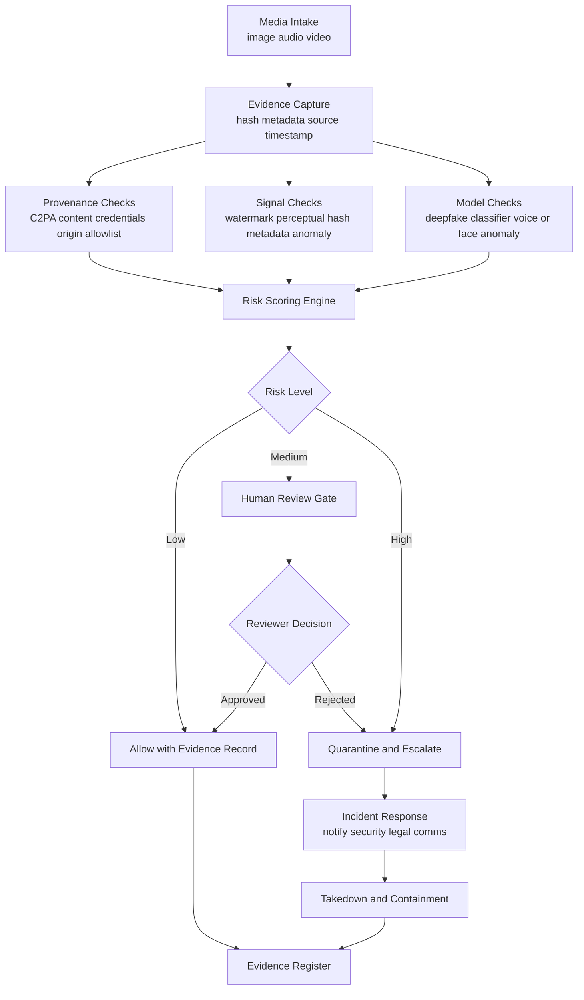

# Synthetic Media Governance Control Plane

A governance-first learning repo for detecting, reviewing, and stopping synthetic media impersonation, including deepfake executive videos, voice-cloned instructions, manipulated evidence, and fraudulent brand communications.

This project is intentionally phased. Each phase teaches one control layer, records evidence, and avoids treating any single detector as authoritative.

## Design Goal

Build a layered control plane that can:

- Intake suspected image, audio, and video assets.
- Preserve chain of custody and cryptographic evidence.
- Run provenance, metadata, watermark, hash, and model-based checks.
- Score risk using multiple signals.
- Quarantine high-risk assets before publication or action.
- Route high-impact identity claims to human review.
- Produce a repeatable audit trail for security, legal, trust, and communications teams.

## Architecture Flow

## Learning Phases

| Phase | Focus | Outcome |
|---|---|---|
| 0 | Repo orientation | Understand the governance control-plane model. |
| 1 | Threat model | Define abuse cases, protected identities, and assets. |
| 2 | Intake and custody | Record source, hash, timestamps, and submitter context. |
| 3 | Provenance checks | Validate Content Credentials, signatures, and trusted origins. |
| 4 | Detection signals | Add metadata, watermark, perceptual hash, and model checks. |
| 5 | Risk scoring | Convert evidence signals into allow, review, or quarantine decisions. |
| 6 | Human review | Require accountable review for high-impact claims. |
| 7 | Enforcement | Quarantine, block, escalate, and preserve evidence. |
| 8 | Audit readiness | Maintain evidence registers, reports, and control traceability. |

Start with [`docs/LEARNING_PHASES.md`](docs/LEARNING_PHASES.md).

## Non-Goals

- This repo does not claim perfect deepfake detection.
- This repo does not treat watermarking, C2PA, or classifiers as sufficient alone.
- This repo does not provide offensive deepfake generation guidance.
- This repo does not automate public accusations without human review.

## Current Status

Initial governance scaffold created.
